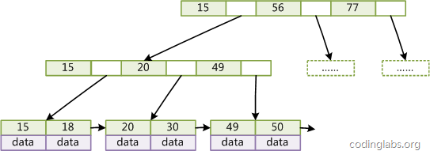
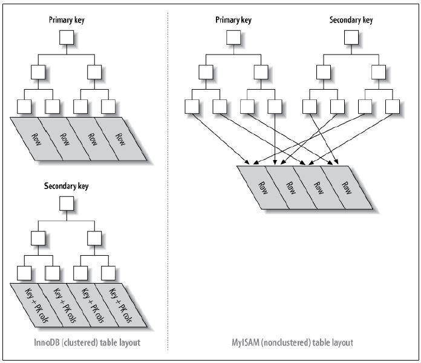

# MySQL索引

* [一、索引的优缺点](#%E4%B8%80%E7%B4%A2%E5%BC%95%E7%9A%84%E4%BC%98%E7%BC%BA%E7%82%B9)
* [二、索引的实现原理](#%E4%BA%8C%E7%B4%A2%E5%BC%95%E7%9A%84%E5%AE%9E%E7%8E%B0%E5%8E%9F%E7%90%86)
  * [1\.全文索引](#1%E5%85%A8%E6%96%87%E7%B4%A2%E5%BC%95)
  * [2\. B Tree索引和B\+Tree索引](#2-b-tree%E7%B4%A2%E5%BC%95%E5%92%8Cbtree%E7%B4%A2%E5%BC%95)
  * [3\.聚簇索引和非聚簇索引](#3%E8%81%9A%E7%B0%87%E7%B4%A2%E5%BC%95%E5%92%8C%E9%9D%9E%E8%81%9A%E7%B0%87%E7%B4%A2%E5%BC%95)
* [三、索引的使用策略](#%E4%B8%89%E7%B4%A2%E5%BC%95%E7%9A%84%E4%BD%BF%E7%94%A8%E7%AD%96%E7%95%A5)
  * [什么时候要使用索引？](#%E4%BB%80%E4%B9%88%E6%97%B6%E5%80%99%E8%A6%81%E4%BD%BF%E7%94%A8%E7%B4%A2%E5%BC%95)
  * [什么时候不要使用索引？](#%E4%BB%80%E4%B9%88%E6%97%B6%E5%80%99%E4%B8%8D%E8%A6%81%E4%BD%BF%E7%94%A8%E7%B4%A2%E5%BC%95)
    * [参考链接](#%E5%8F%82%E8%80%83%E9%93%BE%E6%8E%A5)

## 一、索引的优缺点

优势：快速检索、检索I/O次数，加快检索速度；根据索引分组和排序，可以加快分组和排序；

劣势：索引本身也是表，因此会占用存储空间，一般来说，索引占用的空间的数据表的1.5倍；索引表的维护和创建需要时间成本，这个成本随着数据量增大而增大；构建索引会降低数据表的修改操作（删改查）的效率，因为在修改数据表的同时还需要修改索引表；


## 二、索引的实现原理

B Tree索引，B+Tree索引，哈希索引，全文索引等。

### 1.全文索引

FULLTEXT（全文）索引，仅可用于MyISAM和InnoDB，针对较大的数据，生成全文索引非常的消耗时间和空间。对于文本的大对象，或者较大的Char类型数据，如果使用普通索引，那么匹配文本前几个字符还是可行的，但是想要匹配文本中间的几个单词，那么就要使用LIKE%word%来匹配，这样需要很长的时间来处理，响应时间会大大增加，这种情况，就可以使用FULLTEXT索引了，**在生成FULLTEXT索引时，会为文本生成一份单词的清单，在索引时及根据这个单词的清单来索引。**

FULLTEXT可以在创建表的时候创建，也可以在需要的时候用ALTER或者CREATE INDEX来添加：

```mysql
//创建表的时候添加FULLTEXT索引
CTREATE TABLE my_table(
    id INT(10) PRIMARY KEY,
    name VARCHAR(10) NOT NULL,
    my_text TEXT,
    FULLTEXT(my_text)
)ENGINE=MyISAM DEFAULT CHARSET=utf8;
```

```mysql
//创建表以后，在需要的时候添加FULLTEXT索引
ALTER TABLE my_table ADD FULLTEXT INDEX ft_index(column_name);
```

全文索引的查询也有自己特殊的语法，而不能使用LIKE %查询字符串% 的模糊查询语法

```mysql
SELECT * FROM table_name MATCH(ft_index) AGAINST('查询字符串')；
```


### 2. B Tree索引和B+Tree索引

B Tree的结构如下：


在B Tree的机构下，就可以使用二分查找的查找方式，查找复杂度为h*log(n)，一般来说数的高度是很小的，一般为3左右，因此BTree是一个非常高效的查找结构。


B+Tree的结构如下：





B+Tree对比BTree的优点：

1、磁盘读写代价更低

2、查询速度更稳定

3、拥有顺序索引，添加了只想相邻叶节点的指针，形成了带有顺序访问指针的B+Tree，提高了区间查找的效率


### 3.聚簇索引和非聚簇索引

聚簇索引（InnoDB）：聚簇索引的顺序就是数据的物理存储顺序

非聚簇索引（MyISAM）：索引顺序与数据的物理顺序无关

在索引分类中，我们可以按照索引的键是否为主键来分为“主索引”和“辅助索引”，使用主键键值简历的索引称为”主索引“，其他的称为”辅助索引“。因此主索引只能有一个，辅助索引可以有很多个。

下图可以形象说明聚簇索引和非聚簇索引的区别




此外MyISAM和innoDB的区别总结如下：

|        | MyISAM      | InnoDB                   |
| ------ | ----------- | ------------------------ |
| 索引类型   | 非聚簇         | 聚簇                       |
| 使用操作类型 | 大量select下使用 | 大量inset、delete和update下使用 |

总结如下：

- InnoDB 支持事务，支持行级别锁定，支持 B-tree、Full-text 等索引，不支持 Hash 索引；

- MyISAM 不支持事务，支持表级别锁定，支持 B-tree、Full-text 等索引，不支持 Hash 索引；
- 此外，Memory 不支持事务，支持表级别锁定，支持 B-tree、Hash 等索引，不支持 Full-text 索引； 


## 三、索引的使用策略

### 什么时候要使用索引？

- 主键自动建立唯一索引；
- 经常作为查询条件在WHERE或者OREDER BY语句中出现的列要建立索引；
- 作为排序的列要建立索引；
- 查询中与其他表关联的字段，外键关系简历索引；
- 高并发条件下倾向组合索引；？？
- 用于聚合函数的列可以建立索引，例如使用了max(column_1)或者count(column_1)时的column_1就需要建立索引


### 什么时候不要使用索引？

- 经常增删改的列不要建立索引；
- 有大量重复的列不建立索引；
- 表记录太少不要建立索引。只有当数据表里有已经有了足够多的测试数据（记录超1000条、数据总量超过了MySQL服务器上的内存总量）时，它的性能测试结果才有实际参考价值。


#### 参考链接

[深入理解MySQL索引原理和实现——为什么索引可以加速查询？（CSDN）](https://blog.csdn.net/tongdanping/article/details/79878302)

[BTree和B+Tree详解（CSDN）](https://blog.csdn.net/endlu/article/details/51720299)

