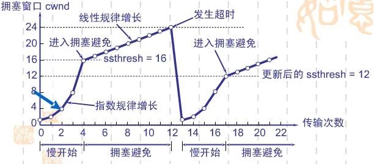
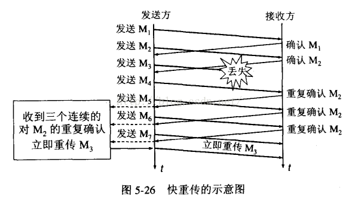

# TCP之流量控制、拥塞控制

* [一、为什么需要流量控制？什么是流量控制？](#%E4%B8%80%E4%B8%BA%E4%BB%80%E4%B9%88%E9%9C%80%E8%A6%81%E6%B5%81%E9%87%8F%E6%8E%A7%E5%88%B6%E4%BB%80%E4%B9%88%E6%98%AF%E6%B5%81%E9%87%8F%E6%8E%A7%E5%88%B6)
* [二、为什么需要拥塞控制？什么是拥塞控制？](#%E4%BA%8C%E4%B8%BA%E4%BB%80%E4%B9%88%E9%9C%80%E8%A6%81%E6%8B%A5%E5%A1%9E%E6%8E%A7%E5%88%B6%E4%BB%80%E4%B9%88%E6%98%AF%E6%8B%A5%E5%A1%9E%E6%8E%A7%E5%88%B6)
* [三、拥塞控制和流量控制的区别](#%E4%B8%89%E6%8B%A5%E5%A1%9E%E6%8E%A7%E5%88%B6%E5%92%8C%E6%B5%81%E9%87%8F%E6%8E%A7%E5%88%B6%E7%9A%84%E5%8C%BA%E5%88%AB)
* [四、使用滑动窗口实现流量控制](#%E5%9B%9B%E4%BD%BF%E7%94%A8%E6%BB%91%E5%8A%A8%E7%AA%97%E5%8F%A3%E5%AE%9E%E7%8E%B0%E6%B5%81%E9%87%8F%E6%8E%A7%E5%88%B6)
* [五、四种拥塞控制方法的详解](#%E4%BA%94%E5%9B%9B%E7%A7%8D%E6%8B%A5%E5%A1%9E%E6%8E%A7%E5%88%B6%E6%96%B9%E6%B3%95%E7%9A%84%E8%AF%A6%E8%A7%A3)
    * [参考链接](#%E5%8F%82%E8%80%83%E9%93%BE%E6%8E%A5)

|  内容  |             关键字             |
| :--: | :-------------------------: |
| 流量控制 |          分组丢失、滑动窗口          |
| 拥塞控制 | 网络拥塞，拥塞窗口、慢开始、拥塞避免、快重传、快恢复。 |

## 一、为什么需要流量控制？什么是流量控制？

​	如果发送者发送数据过快，接受者来不及接收，那么就会有`分组丢失`。为了避免分组丢失，控制发送者的发送速度，是的接收者来得及接收，这就是`流量控制`。

​	流量控制根本目的就是防止分组丢失，他是构成TCP可靠性的一方面。

​	*流量控制：对发送方发送速率的控制。

## 二、为什么需要拥塞控制？什么是拥塞控制？

​	假设主机A给主机B传输数据。

​	根据以往的知识我们知道，当两台主机在传输数据包的时候，如果发送方迟迟没有接收到接收方反馈的ACK，那么发送方就会认为它发送的数据包丢失了，进而会重新传输这个丢失的数据包。

​	然而实际情况有可能是此时有太多主机正在使用信道资源，导致`网络拥塞`了，而A发送的数据包被堵在了半路，迟迟没有到达B。这个时候A误认为是发生了丢包情况，会重新传输这个数据包。

​	结果就是不仅浪费了信道资源，还会使网络更加拥塞。因此，我们需要进行`拥塞控制`。

​	*拥塞控制：防止过多的数据注入到网络当中，这样可以使网络中的路由器或链路不致过载。（通过拥塞窗口处理网络拥塞现象的一种机制）

## 三、拥塞控制和流量控制的区别

​	拥塞控制：拥塞控制是作用于网络的，它是防止过多的数据注入到网络中，避免出现网络负载过大的情况；常用的方法就是：（1）慢开始、拥塞避免（2）快重传、快恢复。

​	流量控制：流量控制是作用于接收者的，它是控制发送者的发送速度从而使接收者来得及接收，防止分组丢失的。

​	相同点：（1）现象都是丢包；（2）实现机制都是让发送方发的慢一点，发的少一点；

​	不同点：（1）丢包位置不同：流量控制丢包位置在接收端上；拥塞控制丢包位置在路由器上。（2）作用对象不同：流量控制的对象是接收方，怕发送方的发的太快，使得接收方来不及处理；拥塞控制的对象是网络，怕发送方发的太快，造成网络拥塞，使得网络来不及处理。

​	*联系：拥塞控制通常表示一个全局性的过程，它会涉及到网络中的所有主机、所有路由器和降级网络传输性能的所有因素；流量控制发生在发送端和接收端之间，只是点到点之间的控制。

## 四、使用滑动窗口实现流量控制

1. 滑动窗口是什么？

   ​	滑动窗口是类似于一个窗口一样的东西，是用来告诉发送端可以发送数据的大小或者说事窗口标记了接收端缓冲区的大小。

   ​	窗口：指的是一次批量的发送多少数据。

2. 为什么会出现滑动窗口？

   ​	在确认应答策略中，对每一个发送的数据段，都要给一个ACK确认应答，收到ACK后再发送下一个数据段，这样有一个比较大的缺点就是性能比较差，尤其是数据往返的时间长的情况。

   ​	所以在此时使用滑动窗口，就可以一次发送多条数据，从而提高性能。

3. 滑动窗口的一些知识点

   1. 接收端将自己可以接收的缓冲区大小放入TCP首部的“窗口大小”字段，通过ACK来通知发送端。
   2. 窗口大小字段越大，说明网络的吞吐率越高。
   3. 窗口大小指的是无需等待确认应答而可以继续发送数据的最大值，即就是说不需要接收端的应答，可以一次连续的发送数据。
   4. 操作系统内核为了维护滑动窗口，需要开辟发送缓存区，来记录当前还有哪些数据没有应答，只有确认应打过的数据，才能从缓冲区删掉。（发送缓冲区如果太大，就会有空间开销）
   5. 接收端一旦发现自己的缓冲区快满了，就会将窗口大小设置成一个更小的值通知给发送端，发送端收到这个值后，就会减慢自己的发送速度
   6. 如果接收端发现自己的缓冲区满了，就会将窗口的大小设置为0，此时发送端将不再发送数据，但是需要定期发送一个窗口探测数据段，是接收端把窗口大小高数发送端。
   7. *滑动窗口中的数据类型：1.已发送，但是还没收到确认的；2.可以发送，但是还没发送的。
   8. *滑动窗口的优点：可以高效可靠的发送大量的数据。

## 五、四种拥塞控制方法的详解

1. 慢开始

   ​	算法原理：当主机开始发送数据时，如果立即将大量数据字节注入到网络中，那么就有可能因为不清楚当前网络的符合情况而引起网络阻塞。所以最后的方法是先探测一下，即由小到大主键增大发送窗口，也就是说，由小到大逐渐增大`拥塞窗口`数值。拥塞窗口cwnd。

   ​	更详细内容见参考链接。

2. 拥塞避免

   ​	算法原理：让拥塞窗口cwnd缓慢增大，即每经过一个往返时间RTT就把发送方的拥塞窗口cwnd加1，而不是加倍，这样拥塞窗口cwnd按线性规律缓慢增长，比慢开始算法的拥塞窗口增长速率缓慢的多。

   

3. 快重传

   ​	快重传算法要求受限接收方收到一个失序的报文段后立刻发出重复确认，而不要等待自己发送数据时菜进行捎带确认。如下图

   

4. 快恢复

   1. 当发送方连续收到三个重复确认时，执行“乘法减小”算法，慢启动门限减半，为了预防网络发生阻塞
   2. 由于发送方现在认为网络很可能没有发生阻塞，因此现在不执行慢启动算法，而是把cwnd值设置为慢启动门限减半后的值，然后开始执行拥塞避免算法，拥塞窗口cwnd值线性增大。

   

#### 参考链接

[通俗易懂讲解TCP流量控制机制](https://www.cnblogs.com/kubidemanong/p/9987810.html)

[5分钟读懂拥塞控制](https://mp.weixin.qq.com/s?__biz=Mzg2NzA4MTkxNQ==&mid=2247485204&amp;idx=1&amp;sn=27daef390eec05b3d5db7cebcdcb4b7c&source=41#wechat_redirect)

[TCP之 流量控制(滑动窗口）和 拥塞控制（拥塞控制的工作过程）](https://blog.csdn.net/dangzhangjing97/article/details/81008836)

[TCP连续ARQ协议和滑动窗口协议](https://blog.csdn.net/guoweimelon/article/details/50879588)

