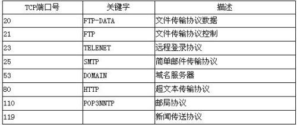

# socket网络编程

  * [什么是网络](#%E4%BB%80%E4%B9%88%E6%98%AF%E7%BD%91%E7%BB%9C)
  * [什么是网络编程](#%E4%BB%80%E4%B9%88%E6%98%AF%E7%BD%91%E7%BB%9C%E7%BC%96%E7%A8%8B)
  * [7层网络模型\-OSI  or  TCP/IP五层模型](#7%E5%B1%82%E7%BD%91%E7%BB%9C%E6%A8%A1%E5%9E%8B-osi--or--tcpip%E4%BA%94%E5%B1%82%E6%A8%A1%E5%9E%8B)
  * [TCP、UDP对比（表格）](#tcpudp%E5%AF%B9%E6%AF%94%E8%A1%A8%E6%A0%BC)
  * [What is Socket?](#what-is-socket)
  * [Socket的作用与组成](#socket%E7%9A%84%E4%BD%9C%E7%94%A8%E4%B8%8E%E7%BB%84%E6%88%90)
  * [Socket传输原理](#socket%E4%BC%A0%E8%BE%93%E5%8E%9F%E7%90%86)
  * [Socket之TCP](#socket%E4%B9%8Btcp)
  * [Socket之UDP](#socket%E4%B9%8Budp)
  * [TCP传输图解](#tcp%E4%BC%A0%E8%BE%93%E5%9B%BE%E8%A7%A3)
  * [UDP传输图解](#udp%E4%BC%A0%E8%BE%93%E5%9B%BE%E8%A7%A3)
* [Socket小试牛刀](#socket%E5%B0%8F%E8%AF%95%E7%89%9B%E5%88%80)
  * [报文、协议、Mac地址](#%E6%8A%A5%E6%96%87%E5%8D%8F%E8%AE%AEmac%E5%9C%B0%E5%9D%80)
  * [IP、端口、远程服务器](#ip%E7%AB%AF%E5%8F%A3%E8%BF%9C%E7%A8%8B%E6%9C%8D%E5%8A%A1%E5%99%A8)
* [Socket\-UDP快速入门](#socket-udp%E5%BF%AB%E9%80%9F%E5%85%A5%E9%97%A8)
  * [UDP是什么？](#udp%E6%98%AF%E4%BB%80%E4%B9%88)
  * [为什么不可靠](#%E4%B8%BA%E4%BB%80%E4%B9%88%E4%B8%8D%E5%8F%AF%E9%9D%A0)
  * [UDP能做什么](#udp%E8%83%BD%E5%81%9A%E4%BB%80%E4%B9%88)
* [UDP核心API讲解](#udp%E6%A0%B8%E5%BF%83api%E8%AE%B2%E8%A7%A3)
  * [API\-DatagramSocket](#api-datagramsocket)
* [UDP单播、广播、多播](#udp%E5%8D%95%E6%92%AD%E5%B9%BF%E6%92%AD%E5%A4%9A%E6%92%AD)
* [Socket\-UDP快速入门](#socket-udp%E5%BF%AB%E9%80%9F%E5%85%A5%E9%97%A8-1)
  * [TCP是什么？](#tcp%E6%98%AF%E4%BB%80%E4%B9%88)
  * [TCP的机制](#tcp%E7%9A%84%E6%9C%BA%E5%88%B6)
  * [TCP链接、传输流程](#tcp%E9%93%BE%E6%8E%A5%E4%BC%A0%E8%BE%93%E6%B5%81%E7%A8%8B)
  * [TCP能做什么？](#tcp%E8%83%BD%E5%81%9A%E4%BB%80%E4%B9%88)
  * [TCP核心API讲解](#tcp%E6%A0%B8%E5%BF%83api%E8%AE%B2%E8%A7%A3)
  * [服务器端Socket流程](#%E6%9C%8D%E5%8A%A1%E5%99%A8%E7%AB%AFsocket%E6%B5%81%E7%A8%8B)
  * [服务器端Socket流程](#%E6%9C%8D%E5%8A%A1%E5%99%A8%E7%AB%AFsocket%E6%B5%81%E7%A8%8B-1)
  * [扩展\-Socket与进程关系](#%E6%89%A9%E5%B1%95-socket%E4%B8%8E%E8%BF%9B%E7%A8%8B%E5%85%B3%E7%B3%BB)
  * [TCP连接的可靠性](#tcp%E8%BF%9E%E6%8E%A5%E7%9A%84%E5%8F%AF%E9%9D%A0%E6%80%A7)
  * [三次握手\-数据随机的必要性](#%E4%B8%89%E6%AC%A1%E6%8F%A1%E6%89%8B-%E6%95%B0%E6%8D%AE%E9%9A%8F%E6%9C%BA%E7%9A%84%E5%BF%85%E8%A6%81%E6%80%A7)
  * [可靠性连接\-四次挥手](#%E5%8F%AF%E9%9D%A0%E6%80%A7%E8%BF%9E%E6%8E%A5-%E5%9B%9B%E6%AC%A1%E6%8C%A5%E6%89%8B)
  * [TCP传输可靠性](#tcp%E4%BC%A0%E8%BE%93%E5%8F%AF%E9%9D%A0%E6%80%A7)

### 什么是网络

- 在计算机领域中，网络是信息传输、接收、共享的虚拟平台
- 通过它把各个点、面、体的信息联系到一起，从而实现这些资源的共享
- 网络是人类发展史来最重要的发明，提高了科技和人类社会的发展

### 什么是网络编程

- 网络编程从大的方面说就是对信息的发送到接收
- 通过操作相应API调度计算机硬件资源，并利用传输管道（网线）进行数据交换的过程
- 更为具体的涉及：网络模型、套接字、数据包

### 7层网络模型-OSI  or  TCP/IP五层模型

https://www.cnblogs.com/qishui/p/5428938.html

<https://www.cnblogs.com/cmyxn/p/6360474.html>

###Socket与TCP、UDP

*socket*是对*TCP*/IP协议*的封装*和应用(程序员层面上)。

### TCP、UDP对比（表格）

|      | TCP                 | UDP             |
| ---- | ------------------- | --------------- |
| 可靠性  | 可靠                  | 不可靠             |
| 连接性  | 面向连接                | 无连接             |
| 报文   | 面向字节流               | 面向报文            |
| 效率   | 传输效率低               | 传输效率高           |
| 双工性  | 全双工                 | 一对一、一对多、多对一、多对多 |
| 流量控制 | 有(滑动窗口)             | 无               |
| 拥塞控制 | 有(慢开始、拥塞避免、快重传、快恢复) | 无               |

### What is Socket?

- 简单来说事IP地址与端口的结合协议（RFC793）
- 一种地址与端口的结合协议
- TCP/IP协议的相关API的总称；网络API的集合实现
- 涵盖了：Stream Socket/Datagram Socket

### Socket的作用与组成

- 在网络传输中用于唯一标示两个端点之间的链接
- **端点**：包括（IP+Port）
- 4个要素：客户端地址、客户端端口、服务器地址、服务器端口

### Socket传输原理

### Socket之TCP

- TCP是面向链接的通信协议
- 通过三次握手建立链接，通讯完成时要拆除链接
- 由于TCP是面向链接的所以只能用于端到端的通讯

### Socket之UDP

- UDP是面向无连接的通讯协议
- UDP数据包括目的端口号和源端口号
- 由于通讯不需要连接，所以可以实现广播发送，并不局限于端到端

### TCP传输图解

### UDP传输图解

###Client-Server Application

- TCP/IP协议中，两个进程间通信的主要模式为：CS模型
- 主要目的：协同网络中的计算机资源、服务模式、进程间数据共享
- 常见的：FTP、SMTP、HTTP

## Socket小试牛刀

- 构建TCP客户端、服务端
- 客户端发送数据
- 服务器读取数据并打印

### 报文、协议、Mac地址

1. 报文段
   - 报文段是指TCP/IP协议网络传输过程中，起着路由导航作用
   - 用以查询各个网络路由网段、IP地址、交换协议等IP数据包
   - 报文段充当整个TCP/IP协议数据包的导航路由功能
   - 报文在传输过程中会不断地封装成分组、包、帧来传输
   - 封装方式就是添加一些控制信息组成的首部，即报文头
2. 传输协议
   - 协议顾名思义，一种规定，约束
   - 约定大于配置，在网络传输中依然使用；网络的传输流程是简装的稳定的，得益于基础的协议构成
   - 简单来说：A->B的传输数据，B能识别，反之B->A的传输数据A也能识别，这就是协议
3. Mac地址
   - Media Access Control或者Medium Access Control
   - 意为媒体访问控制，或称为物理地址、硬件地址
   - 用来定义网络设备的位置
   - 形如：44-45-53-54-00-00；与身份证类似

### IP、端口、远程服务器

1. IP地址

   - IP地址由32位二进制数组成，常以XXX.XXX.XXX.XXX形式表现，每组XXX代表小于或等于255的10进制数
   - 如：208.80.152.2
   - 分为A、B、C、D、E 五大类，其中E类属于特殊保留地址
   - IP地址-IPv4
     - 总数量：42亿个；最终于2011年2月3日用尽
     - 如果主机号是全1，那么这个地址为直接广播地址
     - IP地址"255.255.255.255"为受限广播地址
   - IP地址-IPv6
     - 总共有128位常，IPv6地址的表达形式，一般采用32个十六进制数。也可以想象为1632个
     - 有两个逻辑部分组成：一个64位的网络前缀和一个64位的主机地址，主机地址通常根据物理地址自动生成，叫做EUI-4
     - 2001:0db8:85a3:0000:1319:8a2e:0370:7344
     - IPv4转换成IPv6一定可行，反之不一定可行

2. 端口

   - 如果把IP地址比作一件房子，端口就是出入这间房子的门或窗口

   - 在不同门窗口后有不同的人，房子中的用户与外界交流的出口

   - 外界鸽子（信息）飞到不同窗户也就是给不同的人传递信息

   - 0到1023号端口以及1024到49151号端口都是特殊端口

   - 计算机之间依照互联网传输层TCP/IP协议的协议通信，不同的协议都对应不同的端口

   - 49152到65535好端口属于“动态端口“范围，没有端口可以被正式地注册占用

     特殊端口

     

     ​

## Socket-UDP快速入门

### UDP是什么？

- 英语：User Datagram Protocol，缩写为UDP
- 一种用户数据报协议，又称为用户数据报文协议
- 是一种简单的面向数据报的传输层协议，正式规范为RFC 768
- 用户数据协议、非连接协议

### 为什么不可靠

- 它一旦把应用程序发给网络层的数据发送出去，就不保留数据备份
- UDP在IP数据报的头部仅仅加入了复用和数据校验（字段）
- 发送端生成数据，接收端从网络中抓取数据
- 结构简单、无校验、速度快、容易丢包、可广播

### UDP能做什么

- DNS、TFTP、SNMP
- 视频、音频、普通数据（无关紧要数据）

## UDP核心API讲解

### API-DatagramSocket

- 用于接收与发送UDP的类
- 负责发送某一个UDP包，或者接收UDP包
- 不同于TCP，UDP并没有合并到Socket API中
- DatagramSocket()创建简单实例，不指定端口与IP
- DatagramSocket(int port)创建监听固定端口的实例
- DatagramSocket(int port, InetAddress localAddr)创建固定端口指定IP的实例
- receive(DatagramPacket d)接收
- send(DatagramPacket d)发送
- setTimeout(int timeout)设置超时、毫秒
- close()关闭、释放资源

###API-DatagramPacket

- 用于处理报文

- 将byte数组、目标地址、目标端口等数据包装成报文或者将报文拆卸成byte数组

- 是UDP的发送实体、接收实体

- DatagramPackt(byte[] buf,int offset,int length,InetAddress address,int port)

- 前面3个参数指定buf的使用区间

- 后面2个参数指定目标机器地址与端口

- DatagramPackt(byte[] buf,int offset,int length,SocketAddress address)

- 前面3个参数指定buf的使用区间

- SocketAddress相当于InetAddress+port

- setData(byte[] buf,int offset,int length)

- setData(byte[] buf)

- setLength(int length)

- getData()、getOffset()、getLength()

- setAddress(InetAddress address) 、setPort(int port)

- getAddress()、getPort()

- setSocketAddress(SocketAddress address)

- getSocketAddress()

  ​

## UDP单播、广播、多播

- 单播：点对点
- 多播：给一组发，组播
- 广播：所有人都可以接收

## Socket-UDP快速入门

### TCP是什么？

- 英语：Transmission Control Protocol
- TCP是传输控制协议；是一种面向链接的、可靠的、基于字节流的**传输层**通信协议
- 与UDP一样完成第四层传输层所指定的职责与功能

### TCP的机制

- 三次握手、四次挥手
- 具有校验机制、可靠、数据传输稳定

### TCP链接、传输流程

### TCP能做什么？

- 聊天消息传输、推送
- 单人语音、视频聊天等
- 几乎UDP所能做的都能做、但需要考虑复杂性、性能问题
- 限制：无法进行广播，多播，搜索等操作

### TCP核心API讲解

- socket()创建一个Socket
- bind()绑定一个Socket到一个bending地址的端口上
- connect()连接到远程套接字
- accept()接收一个新的连接
- write()把数据写入到Socket输出流
- read()从Socket输入流读取数据

### 服务器端Socket流程

### 服务器端Socket流程

### 扩展-Socket与进程关系

### TCP连接的可靠性

### 三次握手-数据随机的必要性

### 可靠性连接-四次挥手

### TCP传输可靠性

- 排序、顺序发送、顺序组装
- 丢弃、超时
- 重发机制-定时器

